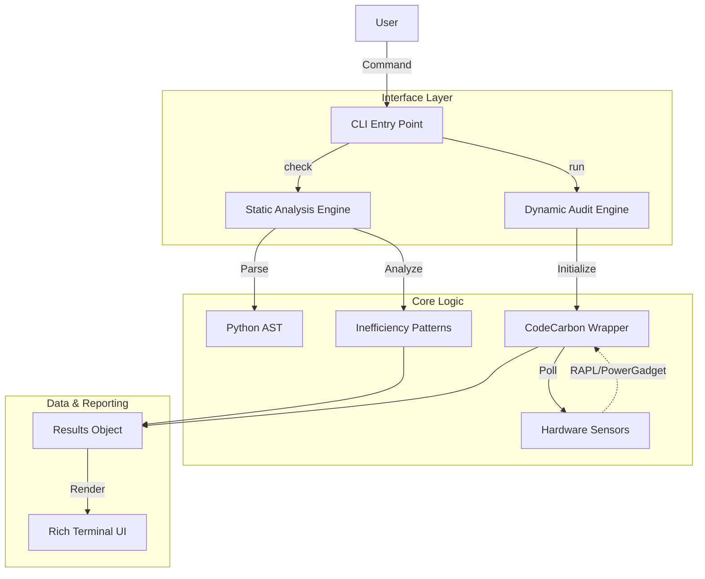

# 🏗️ GreenKode Architecture

This document provides a high-level overview of GreenKode's internal design and how its components interact.

## 🧩 High-Level Design

GreenKode follows a modular architecture, separating the User Interface (CLI) from the core Logic Engines (Static & Dynamic).

## 📦 Core Components

### 1. CLI Entry Point (`src/cli.py`)
-   Built with **Typer**.
-   Handles argument parsing, help messages, and command dispatch.
-   Responsible for the "Look and Feel" of the terminal output.

### 2. Static Analysis Engine (`src/analyzer.py`)
-   **Purpose**: Detect bad code patterns without execution.
-   **Mechanism**: Uses Python's built-in `ast` (Abstract Syntax Tree) module to walk through the code structure.
-   **Key Classes**:
    -   `ComplexityVisitor`: Visits AST nodes to estimate Big-O complexity.
    -   `ImportVisitor`: Tracks imports and their usage.

### 3. Dynamic Audit Engine (`src/runner.py`)
-   **Purpose**: Measure runtime energy.
-   **Mechanism**: Wraps the target script in a subprocess or context manager.
-   **Dependencies**:
    -   **CodeCarbon**: The heavy lifter for interfacing with Intel RAPL and estimating CO2.
    -   **Intel RAPL**: The kernel interface for reading CPU energy counters.

### 4. Reporter (`src/reporter.py`)
-   **Purpose**: Visualize data.
-   **Mechanism**: Uses **Rich** to create tables, progress bars, and colored alerts.
-   **Output**: Generates the "Eco-Grade" and summary tables.

## 🔄 Data Flow

1.  **Input**: User provides a file path (`script.py`).
2.  **Processing**:
    -   **Static**: File is read -> AST parsed -> Visitors walk tree -> Issues collected.
    -   **Dynamic**: Baseline energy read -> Script executed -> Final energy read -> Delta calculated.
3.  **Output**: Metrics are aggregated into a `ScanResult` object and passed to the Reporter for display.

## 🛠️ Key Dependencies

| Library | Purpose |
| :--- | :--- |
| `typer` | CLI framework (modern, type-safe). |
| `rich` | Beautiful terminal formatting. |
| `codecarbon` | Energy measurement and CO2 conversion. |
| `ast` | (Stdlib) Parsing Python code structure. |

---
*Architecture v1.0 - November 2025*
