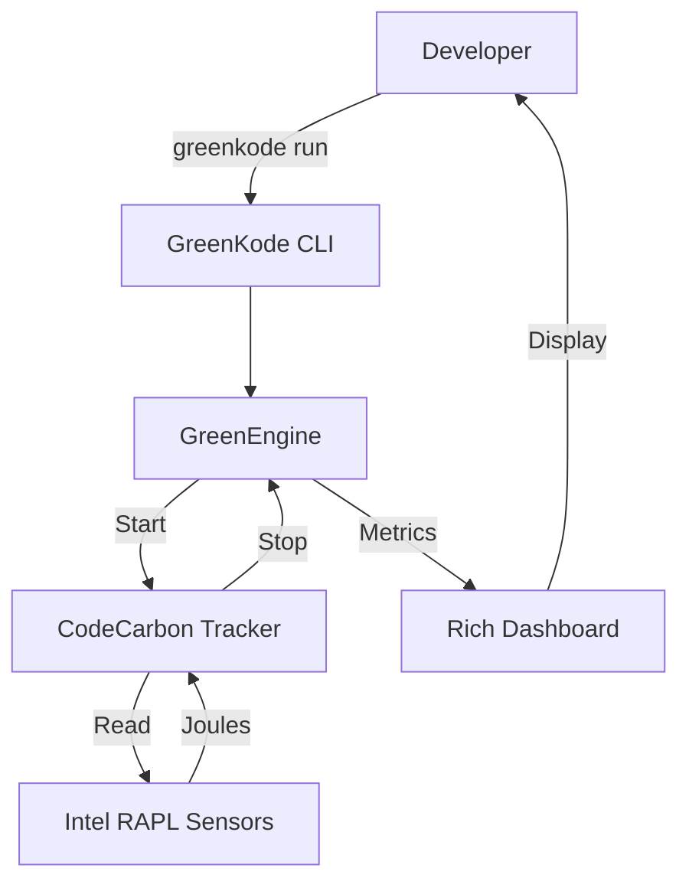

# 📄 GreenKode: Technical Whitepaper
### *Sustainable Software Engineering for a World of 8 Billion*

| **Topic** | Energy & Climate Change |
| :--- | :--- |
| **Author** | Ardellio Satria Anindito |
| **Location** | Bandung, Jawa Barat, Indonesia 🇮🇩 |
| **Date** | November 2025 |

---

## 1. Executive Summary
As the global population surpasses **8 billion**, our digital infrastructure faces an unprecedented energy crisis. Data centers currently consume **1-2% of the world's electricity**, a figure projected to double by 2030. **GreenKode** addresses this by providing developers with a tool to measure and reduce the carbon footprint of their code at the source.

## 2. The Problem: The Invisible Cost of Code
Software is often perceived as "virtual" and carbon-neutral. In reality, every CPU cycle consumes electricity generated by fossil fuels.
*   **Inefficiency**: Poorly written code (e.g., nested loops, redundant I/O) wastes gigawatt-hours of energy annually.
*   **Lack of Visibility**: Developers rarely see the energy bill of their functions.
*   **Scale**: With billions of devices running code, even micro-inefficiencies compound into massive carbon emissions.

## 3. The Solution: GreenKode SDK & CLI
GreenKode is a dual-engine tool designed to integrate sustainability into the development workflow.

### 3.1. Static Analysis Engine (`greenkode check`)
*   **Technology**: Python Abstract Syntax Tree (AST).
*   **Function**: Scans source code without execution to detect algorithmic inefficiencies.
*   **Detection Capabilities**:
    *   ⚠️ **Polynomial Time Complexity**: Detects nested loops (O(n²) or worse).
    *   📦 **Heavy Import Waste**: Identifies unused heavy libraries (e.g., importing `pandas` but not using it).

### 3.2. Dynamic Auditing Engine (`greenkode run`)
*   **Technology**: Intel RAPL (Running Average Power Limit) & `codecarbon`.
*   **Function**: Wraps the application process to measure real-time power draw.
*   **Metrics**:
    *   **Energy**: CPU usage in kWh.
    *   **Carbon**: CO2 equivalents (gCO2eq) based on local grid intensity.
    *   **Eco-Grade**: A gamified score (A+ to F) to incentivize optimization.

## 4. Technical Architecture

## 5. Global Impact Analysis
If adopted by the global developer community, GreenKode could drive significant energy savings.

> **Scenario**: If 1 million developers optimize a daily script to save just **0.001 kWh** per run:
> *   **Daily Savings**: 1,000 kWh
> *   **Yearly Savings**: 365 MWh
> *   **Equivalent**: Removing ~100 cars from the road annually.

## 6. Conclusion
GreenKode is not just a tool; it is a mindset shift. By making energy efficiency visible and measurable, we empower the creators of the digital world to build a sustainable future for our planet's 8 billion inhabitants.

---
*Submitted for the World of 8 Billion Student Video Contest.*

---

## 🔗 See Also
- [**🚀 Getting Started**](GETTING_STARTED.md)
- [**🏗️ Architecture**](ARCHITECTURE.md)
- [**🤝 Contributing**](CONTRIBUTING.md)
