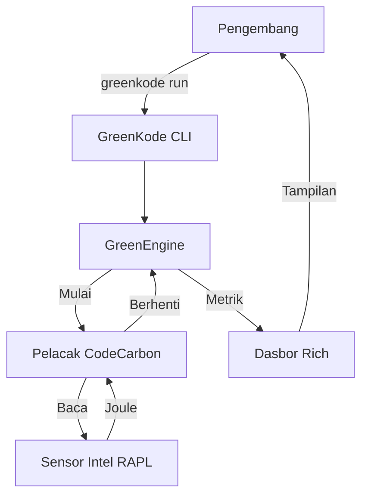

# 📄 GreenKode: Kertas Putih Teknis (Technical Whitepaper)
### *Rekayasa Perangkat Lunak Berkelanjutan untuk Dunia 8 Miliar Penduduk*

| **Topik** | Energi & Perubahan Iklim |
| :--- | :--- |
| **Penulis** | Ardellio Satria Anindito |
| **Lokasi** | Bandung, Jawa Barat, Indonesia 🇮🇩 |
| **Tanggal** | November 2025 |

---

## 1. Ringkasan Eksekutif
Saat populasi global melampaui **8 miliar**, infrastruktur digital kita menghadapi krisis energi yang belum pernah terjadi sebelumnya. Pusat data (data centers) saat ini mengonsumsi **1-2% dari listrik dunia**, angka yang diproyeksikan akan berlipat ganda pada tahun 2030. **GreenKode** menjawab tantangan ini dengan menyediakan alat bagi pengembang untuk mengukur dan mengurangi jejak karbon kode mereka langsung dari sumbernya.

## 2. Masalah: Biaya Tak Terlihat dari Kode
Perangkat lunak sering dianggap "maya" dan netral karbon. Pada kenyataannya, setiap siklus CPU mengonsumsi listrik yang sebagian besar dihasilkan oleh bahan bakar fosil.
*   **Inefisiensi**: Kode yang ditulis dengan buruk (misalnya, *nested loops*, I/O yang berlebihan) membuang gigawatt-jam energi setiap tahunnya.
*   **Kurangnya Visibilitas**: Pengembang jarang melihat "tagihan energi" dari fungsi yang mereka buat.
*   **Skala**: Dengan miliaran perangkat yang menjalankan kode, inefisiensi mikro sekalipun akan terakumulasi menjadi emisi karbon yang masif.

## 3. Solusi: GreenKode SDK & CLI
GreenKode adalah alat bermesin ganda yang dirancang untuk mengintegrasikan keberlanjutan ke dalam alur kerja pengembangan.

### 3.1. Mesin Analisis Statis (`greenkode check`)
*   **Teknologi**: Python Abstract Syntax Tree (AST).
*   **Fungsi**: Memindai kode sumber tanpa menjalankannya untuk mendeteksi inefisiensi algoritmik.
*   **Kemampuan Deteksi**:
    *   ⚠️ **Kompleksitas Waktu Polinomial**: Mendeteksi loop bersarang (O(n²) atau lebih buruk).
    *   📦 **Pemborosan Impor Berat**: Mengidentifikasi pustaka berat yang tidak digunakan (misalnya, mengimpor `pandas` tetapi tidak menggunakannya).

### 3.2. Mesin Audit Dinamis (`greenkode run`)
*   **Teknologi**: Intel RAPL (Running Average Power Limit) & `codecarbon`.
*   **Fungsi**: Membungkus proses aplikasi untuk mengukur penarikan daya secara waktu nyata (*real-time*).
*   **Metrik**:
    *   **Energi**: Penggunaan CPU dalam kWh.
    *   **Karbon**: Ekuivalen CO2 (gCO2eq) berdasarkan intensitas jaringan listrik lokal.
    *   **Nilai Eco**: Skor gamifikasi (A+ hingga F) untuk memotivasi optimasi.

## 4. Arsitektur Teknis

## 5. Analisis Dampak Global
Jika diadopsi oleh komunitas pengembang global, GreenKode dapat mendorong penghematan energi yang signifikan.

> **Skenario**: Jika 1 juta pengembang mengoptimalkan skrip harian untuk menghemat hanya **0,001 kWh** per proses:
> *   **Penghematan Harian**: 1.000 kWh
> *   **Penghematan Tahunan**: 365 MWh
> *   **Setara Dengan**: Menghilangkan ~100 mobil dari jalan raya setiap tahun.

## 6. Kesimpulan
GreenKode bukan sekadar alat; ini adalah perubahan pola pikir. Dengan membuat efisiensi energi terlihat dan terukur, kami memberdayakan para pencipta dunia digital untuk membangun masa depan yang berkelanjutan bagi 8 miliar penduduk planet ini.

---
*Diajukan untuk Kompetisi Video Siswa World of 8 Billion.*

---

## 🔗 Lihat Juga
- [**🚀 Panduan Memulai**](GETTING_STARTED.md)
- [**🏗️ Arsitektur**](ARCHITECTURE.md)
- [**🤝 Berkontribusi**](CONTRIBUTING.md)
